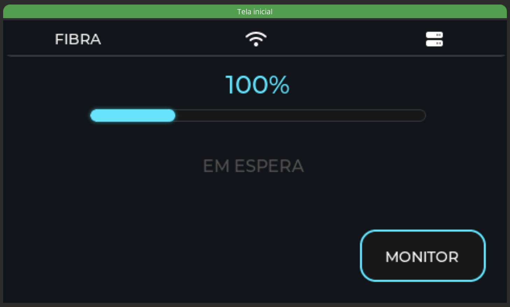
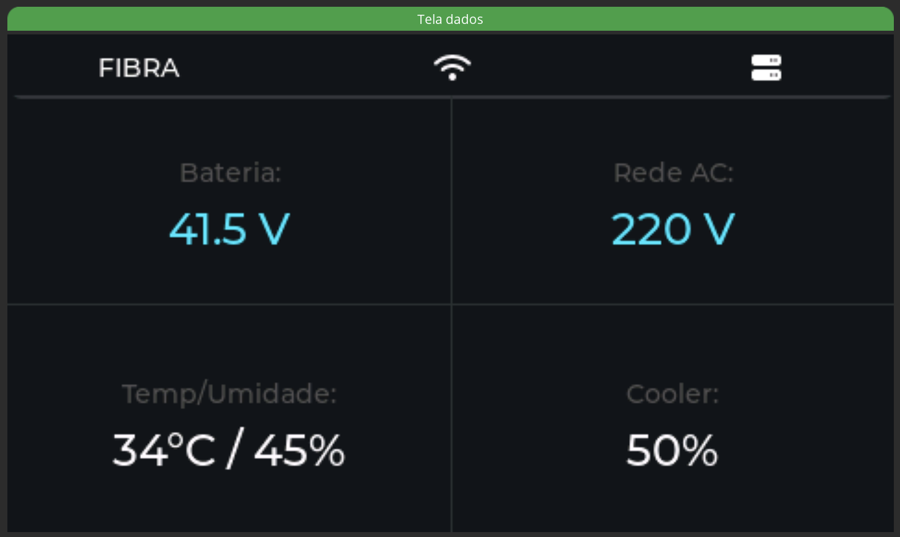
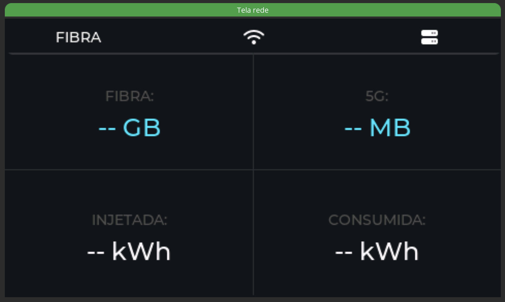
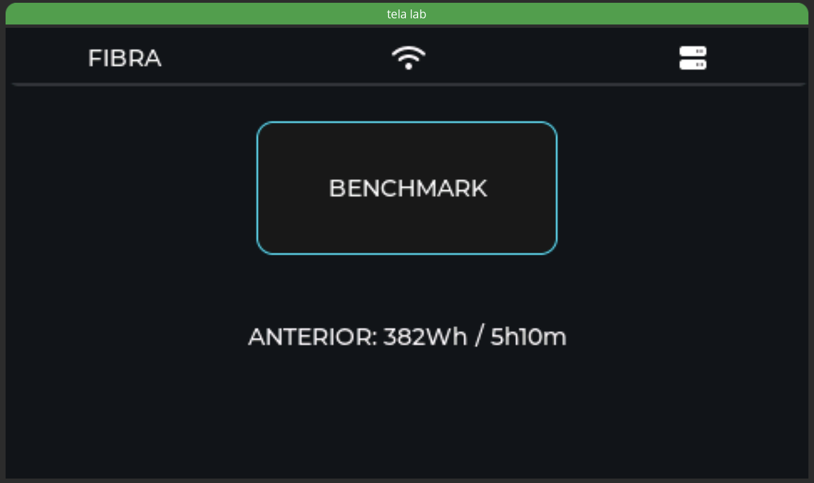
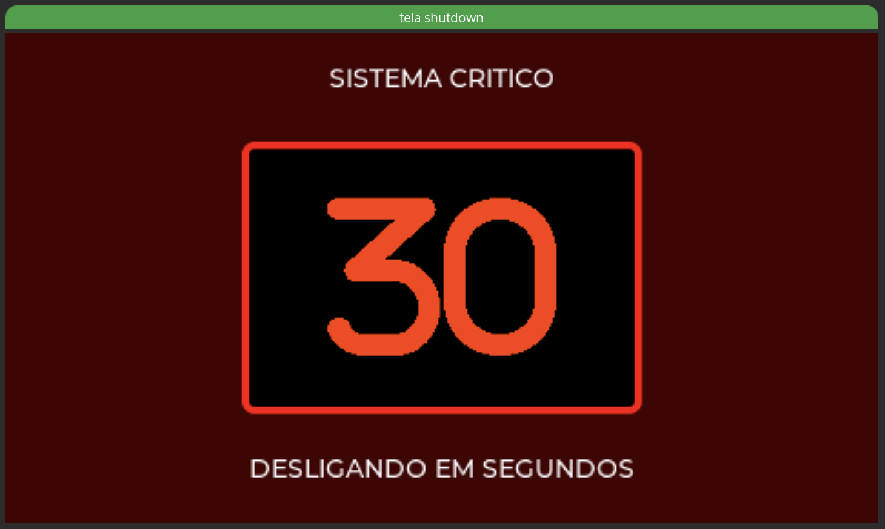

# 🚀 Smart Nobreak "Mission-Critical" (FSM & RTOS Architecture)


Um sistema de gerenciamento de energia ininterrupta (UPS/Nobreak) de alto desempenho projetado para servidores domésticos e infraestrutura de rede (Proxmox/NAS). Desenvolvido no ecossistema ESP32-S3, este firmware transcende a automação amadora, aplicando rigorosos padrões de **Engenharia de Software de Missão Crítica** e arquitetura de **Tempo Real**.

Desenvolvido por **Willian Neves** (CIn - UFPE).

---

## Arquitetura de Tempo Real (Dual-Loop)

Para garantir que o travamento da interface gráfica nunca resulte na queima do hardware físico, o sistema abandona loops monolíticos em favor de uma **Arquitetura Dual-Loop Assíncrona**:

1. **Loop Crítico de Hardware (250ms - 4Hz):** O coração do sistema. Uma *task* de altíssima prioridade que lê sensores ADC via I2C, aplica filtros anti-ruído EMI e alimenta o motor de decisão da Máquina de Estados (FSM). Independe de latência de rede ou renderização gráfica.
2. **Loop de Interface Gráfica e IoT (1000ms - 1Hz):** Camada não-crítica responsável por atualizar as 5 telas do display via barramento paralelo (MIPI RGB), manipular strings seguras (via `snprintf` MISRA-C compliance) e relatar os dados para o Home Assistant via API criptografada (AES-256).

---

### Galeria de Interfaces (HMI)

As telas abaixo são a representação visual direta dos vetores de estado da FSM, atualizadas em tempo real pelo loop secundário de UI.

| Painel Principal (Status) | Telemetria Avançada |
| :---: | :---: |
|  |  |
| *Visão geral do sistema, status da rede e autonomia dinâmica.* | *Monitoramento detalhado de tensões (AC/DC), temperatura e potência.* |

| Rede & Integração HA | Lab & Benchmark | Shutdown Crítico |
| :---: | :---: | :---: |
|  |  |  |
| *Dados de infraestrutura via API.* | *Calibração manual do BMS.* | *Estado terminal (FSM 5, 6 ou 8).* |

---

## 🧮 Máquina de Estados Finita Determinística (FSM)

A lógica central do nobreak não utiliza *scripts* baseados em eventos soltos ou *delays* bloqueantes. O núcleo de decisão é um **Autômato Finito Determinístico (DFA)** rigorosamente mapeado para resolver 16 combinações possíveis de ambiente (2⁴: Rede, Bateria, Temperatura e Lockout), reduzidas a **9 Estados Formais Mutuamente Exclusivos**. 

Transições baseadas em tempo (como o *shutdown* seguro) utilizam contagem de tempo absoluta em hardware (`millis()`) para garantir Invariância Temporal (imunidade a *jitter* de processamento).

### O Mapa de Estados:

* 🟢 `[0] INICIALIZANDO`: Boot seguro. O sistema aguarda o *debounce* inicial dos sensores I2C e a carga NVS. Relés forçados em NA (Normalmente Aberto).
* 🟢 `[1] REDE_OK`: Condição ideal. A energia da concessionária alimenta a carga diretamente.
* 🔵 `[2] CARREGANDO`: Bateria atingiu o patamar de histerese inferior (<= 38.5V). O relé do carregador atraca para recuperar a química das células até atingir 100% (41.5V).
* 🟡 `[3] CONDICIONAMENTO`: Simula um micro-corte (isola a rede e aciona o inversor temporariamente) para ciclar a bateria de 100% para 80%, evitando inchaço por flutuação contínua de tensão máxima.
* 🟠 `[4] BATERIA_ATIVA`: A rede elétrica caiu (0V) ou apresentou anomalia/ruído. O relé da rede atua como isolamento galvânico. A carga é assumida pelo banco de baterias de 12V.
* 🔴 `[5] SHUTDOWN_CRITICO`: Tensão do banco <= 35V. Dispara alarme para o servidor (Proxmox/NAS) iniciar o desligamento seguro (*graceful shutdown*). Inicia *timeout* absoluto de 30 segundos usando delta de hardware (`millis()`).
* 🔥 `[6] ALERTA_TERMICO`: Sensor DHT22 detecta ambiente >= 45°C. Dispara *timeout* crítico para corte térmico, ignorando temporariamente o status da bateria.
* 🧪 `[7] BENCHMARK`: Estado especial para calibração contínua do BMS. Isola a rede propositalmente para medir o trabalho físico (em Watts-hora) extraído da bateria entre 80% e 20%.
* 💀 `[8] FAULT_LOCK`: **Estado Absorvente (Terminal)**. Atingido se os temporizadores dos estados 5 ou 6 expirarem. Executa o corte total (desarme dos relés de saída) para salvar as baterias de descarga profunda ou impedir incêndios. Exige intervenção humana (botão físico por 5s ou API) para destravar.

---

## Tolerância a Falhas e Proteções de Hardware

O sistema foi desenhado considerando que o ambiente elétrico é caótico e que microcontroladores podem sofrer interferência eletromagnética (EMI).

* **Watchdog Timer (WDT) Ativo:** Configurado nativamente no ESP-IDF. Se o núcleo principal travar por 5 segundos, o SoC é resetado por hardware.
* **Debounce Temporal de Rede:** Flutuações na rede não causam "chatter" nos relés. O sistema exige **3000ms contínuos** de leitura limpa na faixa válida de tensão antes de declarar a rede como "Estável".
* **Lockout Persistente (NVS):** Se o sistema entrar no estado terminal de Falha (`FAULT_LOCK`), essa flag é salva na memória não-volátil (Flash). Desligar da tomada e reiniciar o ESP32 não burla a trava; o sistema acorda travado até uma auditoria humana.
* **Determinismo no Boot:** Todos os pinos de relés estão configurados com instrução em hardware `restore_mode: ALWAYS_OFF`, impedindo o acionamento indesejado das bobinas durante flutuações de pinos no processo de boot (*Strapping Pins*).
* **Filtro de Ruído EMI:** Leituras do ADC I2C passam por janelas de mediana de 5 amostras (`median: 5`) para eliminar espúrios gerados pelo chaveamento de fontes e inversores.

---

## Smart BMS e Autonomia Dinâmica de Alta Fidelidade

Diferente de sistemas comerciais que estimam a autonomia baseados em regras genéricas fixas ou divisores de tensão estáticos, este firmware possui um motor matemático de projeção baseada na realidade física.

* **Benchmark Físico:** O usuário pode iniciar o Estado `[7]` a qualquer momento. O sistema integra a corrente real consumida ao longo do tempo (Riemann) usando um shunt, calculando os Wh (Watts-hora) exatos dissipados pela bateria entre a faixa de tensão útil.
* **Ajuste Dinâmico (Degradação):** O valor medido no Benchmark sobrescreve a capacidade teórica da bateria e é gravado na NVS. À medida que a bateria sofre degradação química ao longo dos anos, o nobreak "aprende" a sua nova capacidade, mantendo o cálculo de tempo restante no display 100% fiel à realidade mecânica.

---

## UI/UX: Display Inteligente (SquareLine + LVGL)

O *frontend* utiliza a biblioteca C++ LVGL rodando sobre um barramento de dados paralelo de 16-bits via display MIPI RGB. 

A interface é composta por 5 telas dinâmicas renderizadas a 60 FPS, sem comprometer o loop crítico de energia. As *Strings* na tela são montadas utilizando as funções da biblioteca padrão C que garantem segurança de memória (Memory Safety), evitando travamentos por *Buffer Overflow*. A barra de status superior reflete de forma síncrona, em todas as telas, o status criptografado do Home Assistant, alertando instantaneamente sobre falhas nos servidores locais.

---

## 🛠️ Como Instalar (Compilação Inicial)

Este projeto foi construído para a matriz de compilação do **ESPHome (v2026+)** com ESP-IDF.

**Requisitos:** * Python 3.10+ e ESPHome CLI instalado.
* Placa ESP32-S3 com no mínimo 8MB PSRAM (Octal) ativada.

1. Clone o repositório e certifique-se de que a pasta `src` (contendo o código LVGL exportado) esteja presente.
2. Acesse a raiz onde o `psu.yaml` está localizado.
3. Como a placa não possui credenciais Wi-Fi e requer o `bootloader` completo na primeira vez, compile e grave o binário matriz via terminal usando a porta serial (USB):
   ```bash
   esphome run psu.yaml
